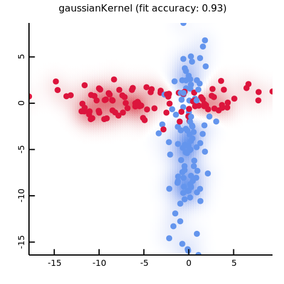
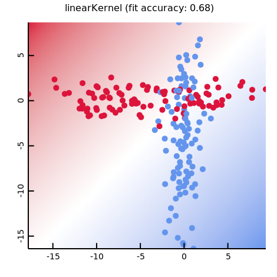

# d-SVM

minimal implmentation of support vector machine for fun

try `dub run` to reproduce these.

## TODO

+ more optimizers (SGD, DCDM)
+ more SVM variants (regression, one-class, structual)
+ tests
